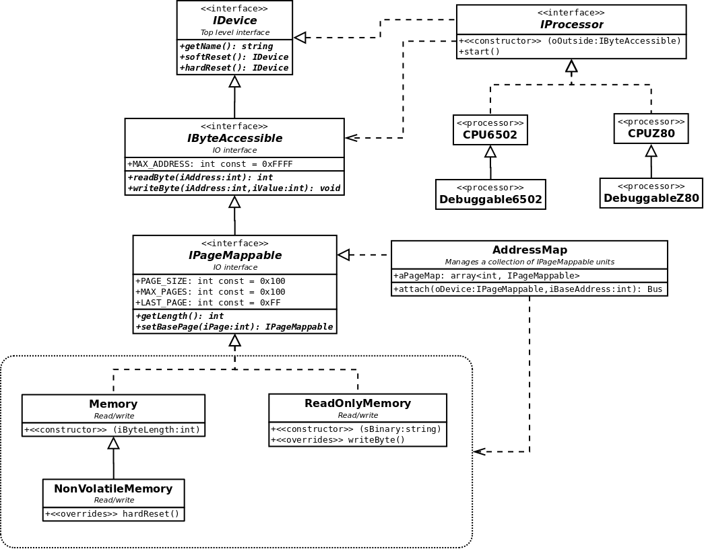

```
    ___ _     ___ _  _ ___ _    _          __ ___
   / __(_)_ _| _ \ || | _ \ |_ (_)_ _____ /  \_  )
   \__ \ \ \ /  _/ __ |  _/ ' \| \ V / -_) () / /
   |___/_/_\_\_| |_||_|_| |_||_|_|\_/\___|\__/___|
 
```
# SixPHPhive02
## The world's least sensible 6502 Emulator

A CPU I've never used, emulated in a language that makes no sense. What could possibly go wrong?

## Motivatiom

The 6502 is a comparatively simple processor that is extremely well documented. The goal is to implement the CPU and support for RAM, ROM and other devices that can be mapped within the 64K address space of the processor. Although the 6502 is the intended target, in principle it should be possible to implement other similar 8-bit processors.

Why choose PHP? Primarily because it's a fun language to hack away in. And besides, it's been done in pretty much every other language already. Even PHP.

## Architecture

The basic architecture begins with a set of interfaces, beginning with IDevice. This is a minimal interface that is then derived into `IByteAccessible` and `IProcessor`. `IByteAccessible` is an IO interface suitable for implementing memory, buses and memory-mapped devices. `IProcessor` is a minimal interface for a CPU that can be implemented by emulator that takes an `IByteAccessible` dependency in order to talk to the outside world.

An absolute minimal implementation would need only a memory implementation of `IByteAccessible` for an `IProcessor` implementation to be able to run. However, the plan is to make things a little more modular by including the notion of page addressing (dividing the 64K memory space into pages, notionally 256 bytes) and having an `AddressMap` that can put several such devices onto a "bus" that is accessed from the CPU. 



It is possible to create `IByteAccessible` entities that can sit between the `IProcessor` and the whatever other memory type device to perform debugging tasks, bus snooping, bank switching and whatever kind of virtual hacking seems like fun.


